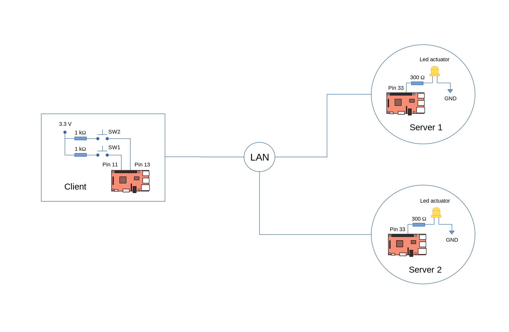

## Edge Raspberry Pi GPIO Access

[](https://raw.githubusercontent.com/EdoLabs/src2/master/quicktour.svg?sanitize=true)

#### Install *m2m* and *array-gpio* on your server endpoints.

```js
$ npm install m2m array-gpio
```

### Rpi Server 1

#### 1. Connect an led on gpio pin 33.

#### 2. Save the code below as *app.js* in your project directory.

```js
const m2m = require('m2m')
const r = require('array-gpio')

let led = r.out(33)

let edge = new m2m.Edge({name:'rpi server 2'})

m2m.connect()
.then(console.log) 
.then(() => {
  
  let port = 8125	
  let host = '192.168.0.120'
    
  edge.createServer({port:port, host:host, allowInsecure:true}, (server) => {
    server.dataSource('gpio-33', (tcp) => {
      if(tcp.payload === 'pulse'){
        led.pulse(500)
      }
    })	
  })

})
.catch(console.log)
```

#### 3. Start rpi server 1 application.

```js
$ node app.js
```
<br>

### Rpi Server 2

#### 1. Connect an led on gpio pin 33.
#### 2. Save the code below as *app.js* in your project directory. <br> The code is similar with rpi server 1 except for the host ip. 

```js
const m2m = require('m2m')
const r = require('array-gpio')

let led = r.out(33)

let edge = new m2m.Edge({name:'rpi server 3'})

m2m.connect()
.then(console.log)
.then(() => {
  
  let port = 8125	
  let host = '192.168.0.121'
    
  edge.createServer({port:port, host:host, allowInsecure:true}, (server) => {
    server.dataSource('gpio-33', (tcp) => {
      if(tcp.payload === 'pulse'){
        led.pulse(500)
      }
    })	
  })

})
.catch(console.log)
```

#### 3. Start rpi server 2 application.

```js
$ node app.js
```

<br>

### Edge Client

#### Install *m2m* and *array-gpio* on your client endpoint.

```js
$ npm install m2m array-gpio
```

The edge client will monitor the gpio input pin 11 and 13 for 'ON' or true state upon pressing any of the switch buttons. If true, it will send a corresponding command to *rpi server 1 or 2* to pulse the gpio pin 33 of the corresponding server in real-time.
#### 1. Connect a momentary switch button on gpio pin's 11 and 13.
#### 2. Save the code below as *app.js* in your client project directory.

```js
const m2m = require('m2m')
const r = require('array-gpio')

let sw1 = r.in(11)
let sw2 = r.in(13)

let edge = new m2m.Edge()

m2m.connect()
.then(console.log)
.then(() => {

  // Create edge client 1 to access rpi server 1
  let ec1 = new edge.client({port:8125, ip:'192.168.0.120', secure:false})
  // Create edge client 2 to access rpi server 2
  let ec2 = new edge.client({port:8125, ip:'192.168.0.121', secure:false})

  // monitor gpio pin 11 for 'ON' or true state  
  sw1.watch((state) => {
    if(state){
       ec1.write('gpio-33', 'pulse') 
    }
  })

  // monitor gpio pin 13 for 'ON' or true state
  sw2.watch((state) => {
    if(state){
      ec2.write('gpio-33', 'pulse') 
    }
  })

})
.catch(console.log)
```

#### 2. Start client application.
```js
$ node app.js
```
You should get a similar output result as shown below.
```js
gpio-11 { pin: 11, state: true }
gpio-11 { pin: 11, state: false }
gpio-13 { pin: 13, state: true }
gpio-13 { pin: 13, state: false }
```


